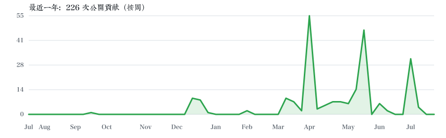

# Hi, I'm yamakawanin 👋

## 最近一年 GitHub 提交曲线

## 我的项目

<!-- PROJECTS:START -->
_自动收集 9 个 GitHub 项目；最后更新：2026-07-06 15:54 CST_

| 项目 | 技术 | 简介 |
| --- | --- | --- |
| [yamakawanin](https://github.com/yamakawanin/yamakawanin) | Python | 暂无简介 |
| 🔒 yamakawanins-blog | — | 私有项目 |
| 🔒 CG-Lab | — | 私有项目 |
| [SUDOKU_FINAL_PROJECT](https://github.com/yamakawanin/SUDOKU_FINAL_PROJECT) | Python | 26春季学期算法与程序设计大作业 |
| [sensor](https://github.com/yamakawanin/sensor) | Python | 26北师大春传感器作业 |
| [yamakawa-code](https://github.com/yamakawanin/yamakawa-code) | TypeScript | 暂无简介 |
| [cognitive-psychology](https://github.com/yamakawanin/cognitive-psychology) | HTML | with xsuan |
| [twitch-live-subtitles](https://github.com/yamakawanin/twitch-live-subtitles) | Python | 暂无简介 |
| [Python-scripts-to-download-videos-audio](https://github.com/yamakawanin/Python-scripts-to-download-videos-audio) | Python | 暂无简介 |
<!-- PROJECTS:END -->

> 曲线按周汇总 GitHub 展示的公开贡献（包括提交、PR、Issue 等）。
> 私有项目仅显示名称，不提供链接、技术或简介。
